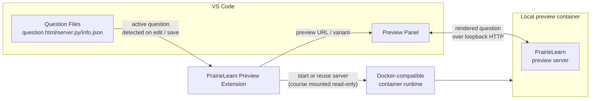

<div align="center">
  
  <h1>PrairieLearn Preview for VS Code</h1>
  <p><strong>Live, in-editor PrairieLearn question previews, rendered beside your code as you write.</strong></p>
  <p>
    <a href="https://marketplace.visualstudio.com/items?itemName=runjuu.pl-preview-vscode"></a>
    <a href="https://open-vsx.org/extension/runjuu/pl-preview-vscode"></a>
    <a href="https://github.com/runjuu/pl-preview-vscode/actions/workflows/ci.yml"></a>
    <a href="./LICENSE"></a>
    <a href="https://code.visualstudio.com/"></a>
  </p>
</div>

[](https://github.com/runjuu/pl-preview-vscode/raw/main/media/demo.mp4)

## Why PrairieLearn Preview?

If you write or TA for a PrairieLearn course, you know the old loop: make a
small edit, leave your editor, find the right browser tab, click Load from
disk, reload, then compare the result and hope you did not lose your place.
Repeat that dozens of times, and the context switching starts to feel like the work. 🤨😩🫠

PrairieLearn Preview turns that into a tighter loop: edit <-> preview.

## Features

- Open the preview from the editor title bar when a PrairieLearn question file is
  active.
- Follow the active editor as you move between question files.
- Refresh automatically after saving, with a manual refresh command when you need
  it.
- Keep the same variant seed across refreshes so edits are easy to compare.
- Reroll the current question with **New variant**.
- Use any Docker-compatible local container runtime.
- Preview **workspace questions** without leaving VS Code.
- Show render and container logs from the **PrairieLearn Preview** Output channel.
- Keep preview servers warm for recently used courses, with a command to stop
  them when you are done.

## Requirements

- VS Code 1.90.0 or newer
- A Docker Engine API-compatible container runtime installed and running, such
  as Docker Desktop or Podman (Colima, Rancher Desktop, and OrbStack work too
  through their Docker-compatible socket)
- A PrairieLearn course folder open in VS Code, with `infoCourse.json` at the
  course root
- PrairieLearn v3/Freeform questions

## Install

Install **PrairieLearn Preview** from your editor's extension registry:

- **VS Code Marketplace:** search for `runjuu.pl-preview-vscode` in the
  Extensions view, or open the
  [Marketplace listing](https://marketplace.visualstudio.com/items?itemName=runjuu.pl-preview-vscode).
- **Open VSX:** install
  [`runjuu.pl-preview-vscode`](https://open-vsx.org/extension/runjuu/pl-preview-vscode)
  in VSCodium or another Open VSX-compatible editor.

PrairieLearn Preview activates when your workspace contains a PrairieLearn
`infoCourse.json` file.

## Quick Start

1. Open a PrairieLearn course folder in VS Code.
2. Open any file inside a question directory, such as
   `questions/my-question/question.html`.
3. Click the preview button in the editor title bar.
4. Keep editing your question source. Save the file to refresh the preview.

The preview opens beside your editor, follows the active PrairieLearn question as
you switch files, and shows clear progress while the local preview environment
starts.

## How it works

PrairieLearn Preview gives you a live edit-and-refresh loop without running a full
local PrairieLearn instance.

When you open a course folder, the extension watches the file you are editing
and works out which question it belongs to by walking up to the nearest
`infoCourse.json` (the course) and to the question's `info.json` under
`questions/`.

The first time you open a preview, it detects your Docker-compatible container
runtime and starts a small local container from a preview image built from my
[PrairieLearn fork](https://github.com/runjuu/PrairieLearn) (pinned to an exact
version for reproducible previews), with your course folder mounted
**read-only**. That container runs a standalone preview server I added to the
fork. The extension points a VS Code webview at the loopback server so the
active question renders beside your editor.

Every time you save, it re-renders the current question, reusing the server that
is already running ("warm") so refreshes are nearly instant. The variant seed
stays the same across refreshes, so before and after are easy to compare, and
**New variant** rerolls it. [Workspace questions](#workspace-questions) preview
the same way, with the interactive workspace opening in its own tab.



## Commands

You can also run PrairieLearn Preview commands from the Command Palette:

| Command | What it does |
| --- | --- |
| **PrairieLearn Preview: Open Preview** | Opens the side-by-side preview for the active question. |
| **PrairieLearn Preview: Refresh preview** | Re-renders the current preview immediately. |
| **PrairieLearn Preview: New variant** | Rerolls the current question's variant seed. |
| **PrairieLearn Preview: Show logs** | Opens the **PrairieLearn Preview** Output channel. |
| **PrairieLearn Preview: Stop preview servers** | Stops all running local preview servers. |
| **PrairieLearn Preview: Delete old preview images** | Removes superseded preview container images after asking for confirmation. |

## Container runtime

PrairieLearn Preview runs the preview server in a local container using any
Docker Engine API-compatible runtime. By default, it auto-detects one: Docker's
socket first, then Podman's. Docker Desktop, Podman, Colima, Rancher Desktop,
and OrbStack all work with no configuration.

To configure runtime behavior, use these VS Code settings:

| Setting | What it does |
| --- | --- |
| `plPreview.containerRuntime` | `auto` (default), `docker`, `podman`, or `custom`. |
| `plPreview.containerHost` | An explicit endpoint, e.g. `unix:///run/user/1000/podman/podman.sock`, `tcp://127.0.0.1:2375`, or `npipe:////./pipe/podman-machine-default`. Required for `custom`; with `auto` it overrides detection. |
| `plPreview.enableWorkspaces` | `true` (default). Preview workspace questions; see [Workspace questions](#workspace-questions). Set to `false` to keep the preview container fully jailed. |

When multiple runtimes are running and `auto` is selected, Docker is preferred;
set `plPreview.containerRuntime` to `podman` to force Podman.

If the selected runtime is installed but stopped, PrairieLearn Preview can help
start it before opening the preview.

**Podman on macOS or Windows.** Podman runs inside a `podman machine` VM whose
socket path is not reliably discoverable. Either run `podman-mac-helper install`
(so the default Docker socket points at Podman and `auto` just works), export
`CONTAINER_HOST` before launching VS Code, or set `plPreview.containerHost` to the
machine's socket (from `podman machine inspect`). On Linux, the rootless socket
(`$XDG_RUNTIME_DIR/podman/podman.sock`) is detected automatically.

## Workspace questions

Workspace questions run an interactive per-variant container, such as a terminal,
VS Code in the browser, or JupyterLab. To preview one, the preview server must be
able to launch that container itself, so PrairieLearn Preview mounts the
container runtime socket into the preview container and connects both to a
shared per-course network.

Everything is proxied through the preview server, so the live workspace opens in
a separate VS Code tab beside the preview. Click **Open workspace** on a
workspace question. From there, you can see the workspace status and reboot or
reset the workspace when you need a fresh run.

Because this lets previewed course code talk to your container runtime
(root-equivalent when the daemon is rootful), it is enabled only when **both** of
these are true:

- **The workspace is trusted.** PrairieLearn Preview declares limited support for
  untrusted workspaces, so other question types still preview in an untrusted folder, but
  workspace previews stay off until you trust the workspace. You can also turn the
  feature off entirely with `plPreview.enableWorkspaces: false`.
- **The runtime is socket-based.** Use Docker Desktop, Docker Engine on Linux,
  or Podman on Linux. A Podman machine on macOS or Windows (reached over a
  TCP/SSH endpoint) has no local socket to mount, so workspace previews are
  unavailable there; plain questions still preview.

Prefer **rootless Podman** where you can: if the mounted socket belongs to a
rootless daemon, a compromise affects your user account rather than host root.

## Limitations

- A Docker-compatible container runtime is required. The preview server runs in a
  local container.
- The first use can take a few minutes while the runtime downloads the preview
  image.
- Only PrairieLearn v3/Freeform questions are previewed.
- Unsaved editor changes are not rendered. Save the file to refresh the preview.

## Troubleshooting

**The preview button is missing.**

Make sure the active file is inside a PrairieLearn question directory under
`questions/`, and that the opened workspace contains the course's
`infoCourse.json`.

**No container runtime is installed or running.**

Install and start a compatible runtime such as Docker Desktop or Podman, then
open the preview again. If you use Podman on macOS or Windows, see **Container
runtime** above for pointing PrairieLearn Preview at the `podman machine`
socket.

**The first preview is slow.**

The first run may download the preview image. Later previews reuse the downloaded
image and warm preview servers.

**The panel says the question type is not previewable.**

PrairieLearn Preview renders v3/Freeform questions. Check the question's `info.json`.

**The preview failed.**

Run **PrairieLearn Preview: Show logs** from the Command Palette and check the
**PrairieLearn Preview** Output channel for the full render or container error
details.

## Development

```sh
pnpm install
pnpm run build
pnpm run test
pnpm run typecheck
```

Press <kbd>F5</kbd> in VS Code and choose **Run Extension** to launch an
Extension Development Host. Open a PrairieLearn course folder, open a question
file, and click the preview button in the editor title bar.

Use `PL_PREVIEW_IMAGE` to point the extension at a self-built preview image.

## Release

1. Move the relevant `CHANGELOG.md` entries out of **Unreleased**, commit that
   changelog update, and start from a clean working tree.
2. Run `pnpm run release` to choose the next version interactively, or run
   `pnpm run release:patch`, `pnpm run release:minor`, or
   `pnpm run release:major`.
